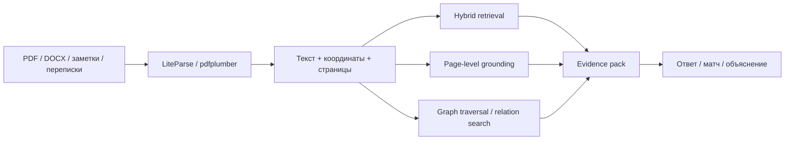

# Ансамбль B — Forensic RAG для доказуемого matching и review

<!-- toc-auto -->
## Contents

- [Схема](#схема)
- [Ожидаемые новые свойства](#ожидаемые-новые-свойства)
- [Смотрите также](#смотрите-также)

> [!NOTE]
> Документ создан на основе исследования. Ссылки ведут на связанные материалы.

<!-- alert-added -->

<!-- summary -->
> Документ создан на основе исследования. Ссылки ведут на связанные материалы. citeturn20view5turn20view6turn34view2turn34view3 Верифицируемые ответы: у пользователя появляется не просто текстовый вывод, а визуально подсвеченный фрагмент страницы, к которому можно вернуться.
Схема
 
Ожидаемые новые свойства
 Верифицируемые ответы: у пользователя появляется не просто текстовый вывод, а визуально подсвеченный фрагмент страницы, к которому можно вернуться.
**Проекты:** Svyazi, LiteParse, Legal RAG, Hybrid RAG, Graph RAG

---
<!-- tags: rag, ingestion, architecture, self-improvement -->

> [!NOTE]
> Документ создан на основе исследования. Ссылки ведут на связанные материалы.

> Источник: `deep-research-report (1).md`.

Если Svyazi‑2.0 должен не только находить людей и идеи, но и объяснять, *почему* возникла рекомендация, нужен evidence‑first слой. Здесь research-docs/LiteParse даёт spatial grounding и HTML‑отчёты, Legal RAG — page‑level модель доказуемости, Hybrid RAG — лёгкий контролируемый backend, а Graph RAG — multi‑hop reasoning по связям между сущностями и пассажами. citeturn20view5turn20view6turn34view2turn34view3

## Схема

```mermaid
flowchart LR
    A[PDF / DOCX / заметки / переписки] --> B[LiteParse / pdfplumber]
    B --> C[Текст + координаты + страницы]
    C --> D[Hybrid retrieval]
    C --> E[Page-level grounding]
    C --> F[Graph traversal / relation search]
    D --> G[Evidence pack]
    E --> G
    F --> G
    G --> H[Ответ / матч / объяснение]
```

## Ожидаемые новые свойства

- **Верифицируемые ответы**: у пользователя появляется не просто текстовый вывод, а визуально подсвеченный фрагмент страницы, к которому можно вернуться. citeturn20view5turn34view2
- **Правильная единица доказательства — страница, а не чанк**: Legal RAG прямо показывает, почему page‑level grounding удобнее для обратного перехода к источнику. citeturn20view6
- **Multi‑hop объяснения**: Graph RAG добавляет ответы на вопросы о связях и косвенных маршрутах между объектами, где обычный chunk‑RAG ломается. citeturn34view3
- **Контроль над retrieval‑слоем без «фреймворкового тумана»**: Hybrid RAG‑подход на pdfplumber/FAISS/TF‑IDF проще дебажить и дешевле держать в локальном контуре, чем тяжёлые универсальные RAG‑фреймворки. citeturn34view2

<!-- see-also -->

---

## Смотрите также
- [04-ensembles-overview](../../01-svyazi/04-ensembles-overview.md)
- [04-приоритетные-ансамбли](../../04-ai-collaborations/04-приоритетные-ансамбли.md)
- [F-evidence-backed-intake](F-evidence-backed-intake.md)
- [evidence-envelope](../architecture/evidence-envelope.md)

_Документ доступен для семантического поиска._ _Индексировано._

<!-- backlinks -->

---

**Кто ссылается на этот документ (9):**
- [OUTLINE](../../OUTLINE.md)
- [READABILITY](../../READABILITY.md)
- [READING_TIME](../../READING_TIME.md)
- [SEARCH](../../SEARCH.md)
- [TABLES](../../TABLES.md)
- [3-forensic-rag](../../ai-collaborations/ensembles/3-forensic-rag.md)
- [components-by-name](../../glossary/components-by-name.md)
- [F-evidence-backed-intake](F-evidence-backed-intake.md)
- _...ещё 1_

<!-- similar-docs -->

---

**Похожие документы:**
- [B-forensic-rag](../../obsidian/svyazi-2-0/ensembles/B-forensic-rag.md) (сходство 0.97)
- [F-evidence-backed-intake](F-evidence-backed-intake.md) (сходство 0.25)
- [F-evidence-backed-intake](../../obsidian/svyazi-2-0/ensembles/F-evidence-backed-intake.md) (сходство 0.24)

