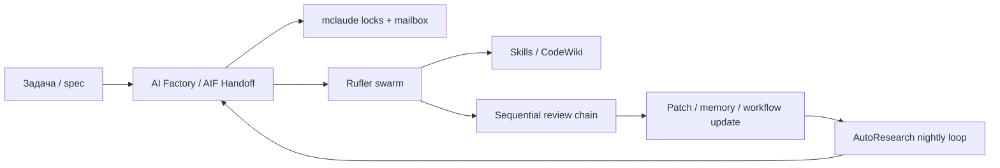

# Ансамбль C — Spec‑driven multi‑agent factory

> [!IMPORTANT]
> Ключевой документ для понимания архитектуры. Рекомендуется прочитать в первую очередь.

<!-- alert-added -->

<!-- summary -->
> > Источник: `deep-research-report (1).md`.
**Проекты:** mclaude, AI Factory, Rufler, AutoResearch

---
<!-- tags: orchestration, self-improvement, collaboration -->

> Источник: `deep-research-report (1).md`.

Для развития самого продукта нужен не просто один агент, а управляемая фабрика: mclaude закрывает locks/handoffs/mailbox, AI Factory/AIF Handoff — spec‑driven pipeline и self‑learning patches, Rufler — декларативное поднятие роя, Skills/CodeWiki — reusable skills и автоматическую кодовую документацию, Sequential — более сильный reviewer‑режим, а AutoResearch — ночную петлю самоулучшения. citeturn20view2turn20view3turn20view4turn12search2turn20view11turn20view19

## Схема

## Ожидаемые новые свойства

- **Параллелизм без хаоса**: locks, mailbox и handoffs снижают шанс, что два агента одновременно поломают один участок системы или понесут устаревший контекст. citeturn20view2turn37search0
- **Patch‑driven learning**: AI Factory накапливает патчи и умеет эволюционно обновлять skills по повторяющимся классам ошибок. citeturn21view6turn29search0
- **Повторяемая оркестрация**: Rufler выносит структуру роя в YAML и даже показывает разрез токенов по задачам, что критично для cost discipline. citeturn20view4turn21view8
- **Улучшение не по интуиции, а по циклу «изменил → измерил → откатил/сохранил»**: AutoResearch ровно эту петлю и формализует. citeturn20view19
- **Review без центрального bottleneck**: Sequential‑протокол в экспериментах автора даёт качество выше coordinator‑режима на сильных моделях. citeturn20view11

<!-- see-also -->

---

**Смотрите также:**
- [04-ensembles-overview](docs/01-svyazi/04-ensembles-overview.md)
- [04-приоритетные-ансамбли](docs/04-ai-collaborations/04-приоритетные-ансамбли.md)
- [H-research-to-product-flywheel](docs/svyazi-2-0/ensembles/H-research-to-product-flywheel.md)
- [ai-factory](docs/svyazi-2-0/components/ai-factory.md)

<!-- similar-docs -->

---

**Похожие документы:**
- [04-ensembles-overview](docs/01-svyazi/04-ensembles-overview.md) (сходство 0.22)
- [04-ensembles-overview](docs/obsidian/01-svyazi/04-ensembles-overview.md) (сходство 0.22)
- [04-приоритетные-ансамбли](docs/04-ai-collaborations/04-приоритетные-ансамбли.md) (сходство 0.20)

