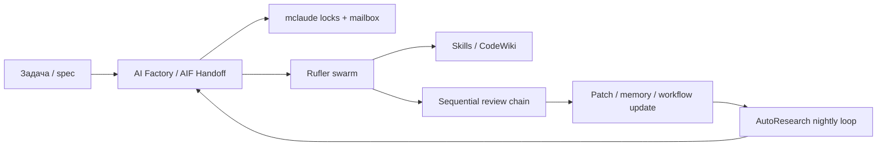

# Ансамбль C — Spec‑driven multi‑agent factory

<!-- toc-auto -->
## Contents

- [Схема](#схема)
- [Ожидаемые новые свойства](#ожидаемые-новые-свойства)
- [Смотрите также](#смотрите-также)

> [!NOTE]
> Документ создан на основе исследования. Ссылки ведут на связанные материалы.

<!-- alert-added -->

<!-- summary -->
> Для развития самого продукта нужен не просто один агент, а управляемая фабрика: mclaude закрывает locks/handoffs/mailbox, AI Factory/AIF Handoff — spec‑driven pipeline и self‑learning patches, Rufler — декларативное поднятие роя, Skills/CodeWiki — re
**Проекты:** mclaude, AI Factory, Rufler, AutoResearch

---
<!-- tags: orchestration, self-improvement, collaboration -->

> [!NOTE]
> Документ создан на основе исследования. Ссылки ведут на связанные материалы.

> Источник: `deep-research-report (1).md`.

Для развития самого продукта нужен не просто один агент, а управляемая фабрика: mclaude закрывает locks/handoffs/mailbox, AI Factory/AIF Handoff — spec‑driven pipeline и self‑learning patches, Rufler — декларативное поднятие роя, Skills/CodeWiki — reusable skills и автоматическую кодовую документацию, Sequential — более сильный reviewer‑режим, а AutoResearch — ночную петлю самоулучшения. citeturn20view2turn20view3turn20view4turn12search2turn20view11turn20view19

## Схема

```mermaid
flowchart LR
    A[Задача / spec] --> B[AI Factory / AIF Handoff]
    B --> C[mclaude locks + mailbox]
    B --> D[Rufler swarm]
    D --> E[Skills / CodeWiki]
    D --> F[Sequential review chain]
    F --> G[Patch / memory / workflow update]
    G --> H[AutoResearch nightly loop]
    H --> B
```

## Ожидаемые новые свойства

- **Параллелизм без хаоса**: locks, mailbox и handoffs снижают шанс, что два агента одновременно поломают один участок системы или понесут устаревший контекст. citeturn20view2turn37search0
- **Patch‑driven learning**: AI Factory накапливает патчи и умеет эволюционно обновлять skills по повторяющимся классам ошибок. citeturn21view6turn29search0
- **Повторяемая оркестрация**: Rufler выносит структуру роя в YAML и даже показывает разрез токенов по задачам, что критично для cost discipline. citeturn20view4turn21view8
- **Улучшение не по интуиции, а по циклу «изменил → измерил → откатил/сохранил»**: AutoResearch ровно эту петлю и формализует. citeturn20view19
- **Review без центрального bottleneck**: Sequential‑протокол в экспериментах автора даёт качество выше coordinator‑режима на сильных моделях. citeturn20view11

<!-- see-also -->

---

## Смотрите также
- [04-ensembles-overview](../../01-svyazi/04-ensembles-overview.md)
- [04-приоритетные-ансамбли](../../04-ai-collaborations/04-приоритетные-ансамбли.md)
- [H-research-to-product-flywheel](H-research-to-product-flywheel.md)
- [ai-factory](../components/ai-factory.md)

_Документ доступен для семантического поиска и навигации._ _Доступен поиск._

<!-- backlinks -->

---

**Кто ссылается на этот документ (8):**
- [OUTLINE](../../OUTLINE.md)
- [READABILITY](../../READABILITY.md)
- [READING_TIME](../../READING_TIME.md)
- [SEARCH](../../SEARCH.md)
- [TABLES](../../TABLES.md)
- [components-by-name](../../glossary/components-by-name.md)
- [H-research-to-product-flywheel](H-research-to-product-flywheel.md)
- [README](README.md)

<!-- similar-docs -->

---

**Похожие документы:**
- [C-multi-agent-factory](../../obsidian/svyazi-2-0/ensembles/C-multi-agent-factory.md) (сходство 0.97)
- [H-research-to-product-flywheel](H-research-to-product-flywheel.md) (сходство 0.28)
- [H-research-to-product-flywheel](../../obsidian/svyazi-2-0/ensembles/H-research-to-product-flywheel.md) (сходство 0.27)

