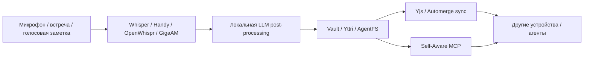

# Ансамбль D — Voice‑first local knowledge mesh

> Источник: `deep-research-report (1).md`.

Для реальных пользователей и операторов Svyazi‑2.0 важно не только «искать по базе», но и пополнять её без боли. Здесь локальный Whisper/Ollama‑стек даёт ввод, Handy/OpenWhispr/GigaAM — удобный UX, Yttri — более широкий local‑first workspace вокруг заметок/встреч/документов, AgentFS — файловую агентную оболочку, а Yjs/Automerge — мультидевайсный sync‑слой. Self‑Aware MCP добавляет правильный time/location context поверх этого. citeturn21view10turn21view11turn21view12turn35search0turn27view0turn11search0turn11search11turn20view12

## Схема

## Ожидаемые новые свойства

- **Нулевой friction для входа данных**: мысль после звонка или встречи сразу превращается в текст и может быть автоматически структурирована. citeturn21view10turn35search0
- **Локальная обработка вместо облачной утечки контекста**: и локальный speech‑to‑text, и local‑first workspace, и CRDT‑sync работают в модели «данные принадлежат устройству пользователя». citeturn21view10turn35search0turn11search11
- **Meeting‑to‑graph pipeline**: Yttri уже мыслит встречу как workspace с транскрипцией, summary и связями; Svyazi‑2.0 может забирать оттуда эпизоды в память и профили. citeturn35search0
- **Контекст реального мира доступен агенту как tool, а не как догадка**: Self‑Aware MCP закрывает проблемы часового пояса, ОС, даты и локации. citeturn20view12turn30search1
