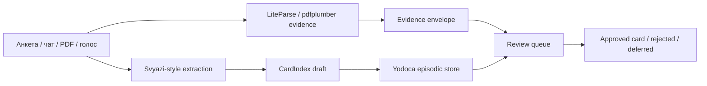

# Ансамбль F — Evidence‑Backed Community Intake

<!-- summary -->
> > Источник: `deep-research-report (3).md` (ансамбли «второго порядка»).
**Проекты:** Svyazi, CardIndex, LiteParse, Hybrid RAG, Yodoca

---
<!-- tags: memory, rag, knowledge, ingestion, local-first, architecture, collaboration -->

> Источник: `deep-research-report (3).md` (ансамбли «второго порядка»).

Цель не в том, чтобы искать коллаборации по уже готовым карточкам, а в том, чтобы превращать хаотичный входящий поток — анкеты, чаты, PDF‑документы, заметки после созвонов, голосовые эпизоды — в нормализованный поток карточек с подтверждаемыми основаниями и review‑очередью. Здесь Svyazi даёт extraction и CardIndex, LiteParse/Hybrid RAG — evidence‑слой, Self‑Aware MCP — контекст времени и среды, а Yodoca — консолидатор для «сырых эпизодов», которые не должны сразу попадать в долгоживущую истину. Это превращает intake‑контур в нечто вроде «редакции сигналов», а не только «парсера профилей». citeturn41search0turn20view5turn34view2turn20view12turn21view0

## Схема

## Новые свойства

Система начинает различать **достоверное, предположительное и просто свежее**. Для сообществ и коллабораций это критически важно: некоторые сигналы должны жить как «видели это в разговоре», а не как «подтверждённый навык или проектная роль». Без такого режима memory‑слой слишком быстро переходит от полезной ассоциации к плохому структурному слуху. Эту разницу прямо поддерживают и Svyazi через `raw`/`inferred`‑мышление, и Yodoca через conservative consolidator, и forensic RAG через доказуемую привязку к источнику. citeturn41search0turn21view0turn20view5turn20view6

<!-- see-also -->

---

**Смотрите также:**
- [10-second-order-ensembles](docs/01-svyazi/10-second-order-ensembles.md)
- [10-новые-ансамбли-следующего-шага](docs/04-ai-collaborations/10-новые-ансамбли-следующего-шага.md)
- [D-voice-first-mesh](docs/svyazi-2-0/ensembles/D-voice-first-mesh.md)
- [B-forensic-rag](docs/svyazi-2-0/ensembles/B-forensic-rag.md)

