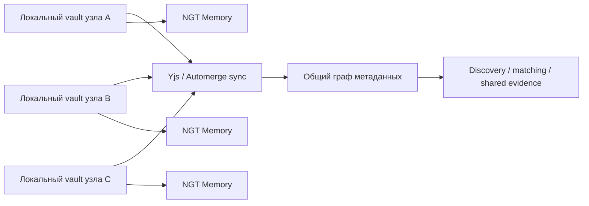

# Ансамбль G — Federated Local‑First Community Graph

<!-- summary -->
> > Источник: `deep-research-report (3).md`.
**Проекты:** Svyazi, AgentFS, NGT Memory, Yjs, Automerge

---
<!-- tags: memory, rag, knowledge, ingestion, local-first, architecture -->

> Источник: `deep-research-report (3).md`.

Здесь главный эффект даёт не одна новая функция, а изменение формы владения системой. AgentFS даёт vault‑ядро, Yjs/Automerge — conflict‑free local‑first sync, NGT Memory — очень быстрый ассоциативный слой, Self‑Aware MCP — contextual tools, а budget/security plane — периметр. Из этих частей получается не просто одна база знаний на одном ноутбуке, а сеть локальных узлов, которые умеют синхронизировать часть структуры без навязывания полного централизованного облака. На этом уровне Svyazi‑2.0 превращается из single‑operator инструмента в community infrastructure, где узлы могут быть персональными, командными или тематическими. citeturn27view0turn11search0turn11search11turn22view4turn20view12turn39view0turn20view10

## Схема

## Новое свойство

**Не только privacy, но и архитектурная живучесть.** Когда профиль, заметка, эпизод и документ существуют локально, а наружу синхронизируется только та часть структуры, которую сообщество хочет шарить, появляется новый класс возможных сценариев: приватные персональные слои, полуобщие тематические слои и публичный discovery‑индекс. Это намного лучше соответствует задачам экспертных сообществ, чем either/or‑выбор между «всё в облако» и «всё только локально». Технически такую форму владения поддерживают local‑first движки и файловые агентные слои; смысловое усиление даёт NGT‑style associative memory поверх разделённого пространства. citeturn11search11turn27view0turn22view4

<!-- see-also -->

---

**Смотрите также:**
- [10-second-order-ensembles](docs/01-svyazi/10-second-order-ensembles.md)
- [10-новые-ансамбли-следующего-шага](docs/04-ai-collaborations/10-новые-ансамбли-следующего-шага.md)
- [D-voice-first-mesh](docs/svyazi-2-0/ensembles/D-voice-first-mesh.md)
- [privacy](docs/svyazi-2-0/security/privacy.md)

