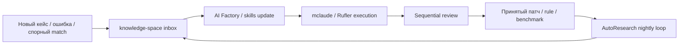

# Ансамбль H — Research‑to‑Product Flywheel

> Источник: `deep-research-report (3).md`.

Предыдущая версия отчёта уже показывала, что AI Factory, mclaude, Rufler, Skills и AutoResearch хорошо смотрятся как build‑контур. Но следующий шаг интереснее: knowledge-space становится не просто хранилищем знаний, а приёмником результатов ночных исследований; CodeWiki и Skills превращают эти результаты в переносимую агентную компетенцию; а AutoResearch и Sequential работают не только по коду, но и по prompts, card policies, evidence scoring и quality thresholds. Это делает Svyazi‑2.0 не просто продуктом, а системой, которая сама постепенно улучшает собственные правила интерпретации и модерации. citeturn33view2turn20view15turn12search2turn20view2turn20view3turn20view4turn20view19turn20view11

## Схема

## Новое свойство

**Изменение качества системы становится повторяемым артефактом.** Ошибка не заканчивается «мы поправили prompt», а порождает новый card pattern, skill patch, regression test или benchmark case. С этой точки зрения knowledge-space и AI Factory особенно комплементарны: один умеет хранить уже осмысленные reference‑карты и gotchas, другой — эволюционно перерабатывать практические ошибки в навыки и workflow‑правила. citeturn33view2turn20view3turn29search0
