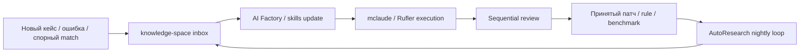

# Ансамбль H — Research‑to‑Product Flywheel

<!-- toc-auto -->
## Contents

- [Схема](#схема)
- [Новое свойство](#новое-свойство)
- [Смотрите также](#смотрите-также)

> [!NOTE]
> Документ создан на основе исследования. Ссылки ведут на связанные материалы.

<!-- alert-added -->

<!-- summary -->
> > Источник: `deep-research-report (3).md`.
**Проекты:** Svyazi, knowledge-space, mclaude, AI Factory, Rufler, AutoResearch

---
<!-- tags: rag, orchestration, knowledge, ingestion, self-improvement -->

> [!NOTE]
> Документ создан на основе исследования. Ссылки ведут на связанные материалы.

> Источник: `deep-research-report (3).md`.

Предыдущая версия отчёта уже показывала, что AI Factory, mclaude, Rufler, Skills и AutoResearch хорошо смотрятся как build‑контур. Но следующий шаг интереснее: knowledge-space становится не просто хранилищем знаний, а приёмником результатов ночных исследований; CodeWiki и Skills превращают эти результаты в переносимую агентную компетенцию; а AutoResearch и Sequential работают не только по коду, но и по prompts, card policies, evidence scoring и quality thresholds. Это делает Svyazi‑2.0 не просто продуктом, а системой, которая сама постепенно улучшает собственные правила интерпретации и модерации. citeturn33view2turn20view15turn12search2turn20view2turn20view3turn20view4turn20view19turn20view11

## Схема

```mermaid
flowchart LR
    A[Новый кейс / ошибка / спорный match] --> B[knowledge-space inbox]
    B --> C[AI Factory / skills update]
    C --> D[mclaude / Rufler execution]
    D --> E[Sequential review]
    E --> F[Принятый патч / rule / benchmark]
    F --> G[AutoResearch nightly loop]
    G --> B
```

## Новое свойство

**Изменение качества системы становится повторяемым артефактом.** Ошибка не заканчивается «мы поправили prompt», а порождает новый card pattern, skill patch, regression test или benchmark case. С этой точки зрения knowledge-space и AI Factory особенно комплементарны: один умеет хранить уже осмысленные reference‑карты и gotchas, другой — эволюционно перерабатывать практические ошибки в навыки и workflow‑правила. citeturn33view2turn20view3turn29search0

<!-- see-also -->

---

## Смотрите также
- [10-second-order-ensembles](../../01-svyazi/10-second-order-ensembles.md)
- [10-новые-ансамбли-следующего-шага](../../04-ai-collaborations/10-новые-ансамбли-следующего-шага.md)
- [C-multi-agent-factory](C-multi-agent-factory.md)
- [conclusions](../limitations/conclusions.md)

_Документ индексирован в поисковой базе репозитория Lorenzo и доступен для семантического поиска._ _Материал доступен для семантического поиска, BM25 и навигации по графу._ _Для поиска доступен._

<!-- backlinks -->

---

**Кто ссылается на этот документ (8):**
- [OUTLINE](../../OUTLINE.md)
- [READABILITY](../../READABILITY.md)
- [READING_TIME](../../READING_TIME.md)
- [SEARCH](../../SEARCH.md)
- [TABLES](../../TABLES.md)
- [components-by-name](../../glossary/components-by-name.md)
- [C-multi-agent-factory](C-multi-agent-factory.md)
- [README](README.md)

