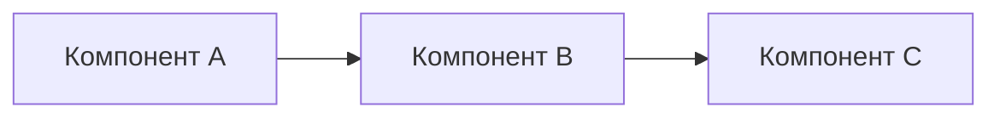

# Ансамбль: [Название]

<!-- summary -->
> <!-- summary: Ансамбль из X компонентов для Y задачи -->

---


<!-- summary: Ансамбль из X компонентов для Y задачи -->
<!-- tags: ансамбль, архитектура -->

## Назначение

[Какую задачу решает ансамбль. Почему именно эта комбинация компонентов.]

## Компоненты

| Компонент | Роль | Лицензия |
|-----------|------|----------|
| [Проект A] | [роль] | [лицензия] |
| [Проект B] | [роль] | [лицензия] |

## Архитектурная схема



## Контракт взаимодействия

```yaml
input:
  type: [тип входа]
  format: [формат]
output:
  type: [тип выхода]
  format: [формат]
```

## Риски и ограничения

- [Риск 1]
- [Ограничение 1]

## MVP-шаги

1. [Шаг 1]
2. [Шаг 2]
3. [Шаг 3]

---
_Создано: 2026-04-29_

<!-- see-also -->

---

**Смотрите также:**
- [project-component](../obsidian/templates/project-component.md)
- [decision-record](../obsidian/templates/decision-record.md)
- [research-summary](../autofilled/research-summary.md)

<!-- backlinks-auto -->
## Упоминается в

- [Appendix B: Примеры расхождений и их разрешения](../02-anthropic-vacancies/119-appendix-b-примеры-расхождений-и-их-разрешения.md)
- [Что этот документ не решает](../02-anthropic-vacancies/298-что-этот-документ-не-решает.md)
- [Шаблоны документов](README.md)

<!-- related-auto -->
## Связанные документы

- [ADR: [Название решения]](decision-record.md) _25%_
- [[Название компонента]](project-component.md) _21%_
- [[Тема исследования]](research-note.md) _21%_
- [Шаблоны документов](README.md) _17%_

<!-- similar-docs -->

---

**Похожие документы:**
- [ensemble](docs/obsidian/templates/ensemble.md) (сходство 0.51)
- [decision-record](docs/templates/decision-record.md) (сходство 0.33)
- [research-summary](docs/autofilled/research-summary.md) (сходство 0.31)

