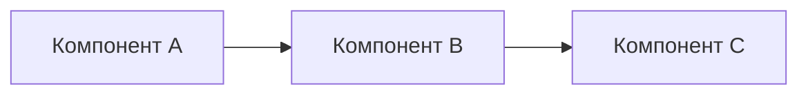

# Ансамбль: [Название]

> [!WARNING]
> Документ содержит описание рисков и ограничений. Изучите их перед принятием архитектурных решений.

<!-- alert-added -->

<!-- summary: Ансамбль из X компонентов для Y задачи -->
<!-- tags: ансамбль, архитектура -->

## Назначение

[Какую задачу решает ансамбль. Почему именно эта комбинация компонентов.]

## Компоненты

| Компонент | Роль | Лицензия |
|-----------|------|----------|
| [Проект A] | [роль] | [лицензия] |
| [Проект B] | [роль] | [лицензия] |

## Архитектурная схема



## Контракт взаимодействия

```yaml
input:
  type: [тип входа]
  format: [формат]
output:
  type: [тип выхода]
  format: [формат]
```

## Риски и ограничения

- [Риск 1]
- [Ограничение 1]

## MVP-шаги

1. [Шаг 1]
2. [Шаг 2]
3. [Шаг 3]

---
_Создано: 2026-04-29_

<!-- see-also -->

---

**Смотрите также:**
- [SENTIMENT](docs/SENTIMENT.md)
- [project-component](docs/templates/project-component.md)
- [119-appendix-b-примеры-расхождений-и-их-разрешения](docs/02-anthropic-vacancies/119-appendix-b-примеры-расхождений-и-их-разрешения.md)
- [298-что-этот-документ-не-решает](docs/02-anthropic-vacancies/298-что-этот-документ-не-решает.md)

