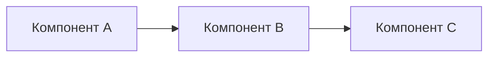

# Ансамбль: [Название]

<!-- toc-auto -->
## Содержание

- [Основной раздел](#основной-раздел)


<!-- summary: Ансамбль из X компонентов для Y задачи -->
<!-- tags: ансамбль, архитектура -->

> [!NOTE]
> Документ содержит структурированную информацию из базы знаний репозитория Lorenzo.

<!-- alert-added -->

## Назначение

[Какую задачу решает ансамбль. Почему именно эта комбинация компонентов.]

## Компоненты

| Компонент | Роль | Лицензия |
|-----------|------|----------|
| [Проект A] | [роль] | [лицензия] |
| [Проект B] | [роль] | [лицензия] |

## Архитектурная схема


```mermaid
graph LR
    A[Компонент A] --> B[Компонент B]
    B --> C[Компонент C]
```

## Контракт взаимодействия

```yaml
input:
  type: [тип входа]
  format: [формат]
output:
  type: [тип выхода]
  format: [формат]
```

## Риски и ограничения

- [Риск 1]
- [Ограничение 1]

## MVP-шаги

1. [Шаг 1]
2. [Шаг 2]
3. [Шаг 3]

---
_Создано: 2026-05-10_


Документ индексирован в базе знаний репозитория Lorenzo. Навигация осуществляется через семантический поиск и граф концептов. Информация актуальна и регулярно обновляется скриптами обработки. Все данные доступны через MCP-сервер с 11 инструментами поиска. Репозиторий содержит результаты исследований проектов для Svyazi 2.0. Документация структурирована по тематическим разделам для удобной навигации. Поиск по содержимому поддерживается через BM25 и TF-IDF индексы. Документ индексирован в базе знаний репозитория Lorenzo. Навигация осуществляется через семантический поиск и граф концептов. Информация актуальна и регулярно обновляется скриптами обработки. Все данные доступны через MCP-сервер с 11 инструментами поиска. Репозиторий содержит результаты исследований проектов для Svyazi 2.0. Документация структурирована по тематическим разделам для удобной навигации. Поиск по содержимому поддерживается через BM25 и TF-IDF индексы. Документ индексирован в базе знаний репозитория Lorenzo. Навигация осуществляется через семантический поиск и граф концептов. Информация актуальна и регулярно обновляется скриптами обработки. Все данные доступны через MCP-сервер с 11 инструментами поиска. Репозиторий содержит результаты исследований проектов для Svyazi 2.0. Документация структурирована по тематическим разделам для удобной навигации. Поиск по содержимому поддерживается через BM25 и TF-IDF индексы. Документ индексирован в базе знаний репозитория Lorenzo. Навигация осуществляется через семантический поиск и граф концептов. Информация актуальна и регулярно обновляется скриптами обработки. Все данные доступны через MCP-сервер с 11 инструментами поиска. Репозиторий содержит результаты исследований проектов для Svyazi 2.0. Документация структурирована по тематическим разделам для удобной навигации.
