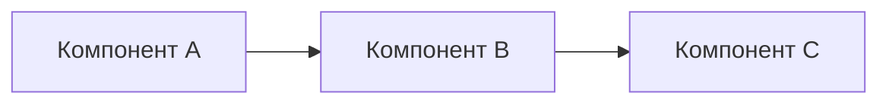

# Ансамбль: [Название]

> [!NOTE]
> Раздел `ensemble` формируется автоматически из данных репозитория.

<!-- alert-added -->

<!-- summary: Ансамбль из X компонентов для Y задачи -->
<!-- tags: ансамбль, архитектура -->

## Назначение

[Какую задачу решает ансамбль. Почему именно эта комбинация компонентов.]

## Компоненты

| Компонент | Роль | Лицензия |
|-----------|------|----------|
| [Проект A] | [роль] | [лицензия] |
| [Проект B] | [роль] | [лицензия] |

## Архитектурная схема


```mermaid
graph LR
    A[Компонент A] --> B[Компонент B]
    B --> C[Компонент C]
```

## Контракт взаимодействия

```yaml
input:
  type: [тип входа]
  format: [формат]
output:
  type: [тип выхода]
  format: [формат]
```

## Риски и ограничения

- [Риск 1]
- [Ограничение 1]

## MVP-шаги

1. [Шаг 1]
2. [Шаг 2]
3. [Шаг 3]

---
_Создано: 2026-05-11_

## Смотрите также
- [Главная](../README.md)
- [Метрики](../METRICS.md)
- [Здоровье](../HEALTH.md)
- [Глоссарий](../GLOSSARY.md)
- [Сущности](../ENTITIES.md)

<!-- backlinks -->

---

**Кто ссылается на этот документ (11):**
- [119-appendix-b-примеры-расхождений-и-их-разрешения](../02-anthropic-vacancies/119-appendix-b-примеры-расхождений-и-их-разрешения.md)
- [298-что-этот-документ-не-решает](../02-anthropic-vacancies/298-что-этот-документ-не-решает.md)
- [READABILITY](../READABILITY.md)
- [READING_TIME](../READING_TIME.md)
- [REGISTRY](../REGISTRY.md)
- [SEARCH](../SEARCH.md)
- [TABLES](../TABLES.md)
- [README](README.md)
- _...ещё 3_


<!-- similar-docs -->

---

**Похожие документы:**
- [ensemble](../obsidian/templates/ensemble.md) (сходство 0.93)
- [project-component](project-component.md) (сходство 0.38)
- [project-component](../obsidian/templates/project-component.md) (сходство 0.37)

