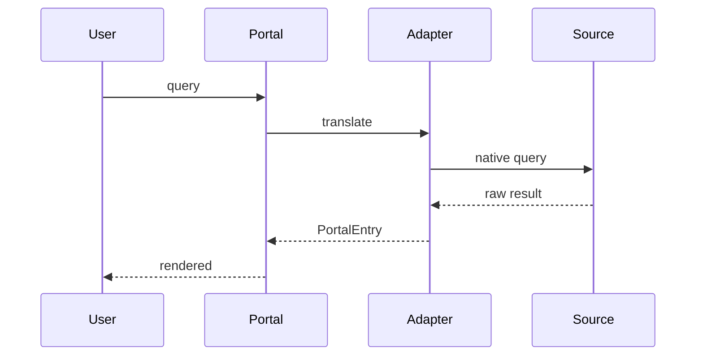

# [Название протокола]

<!-- summary -->
> protocol_name: "[Название протокола]"

---


<!-- summary: Что делает протокол и какую проблему решает -->
<!-- tags: протокол, спецификация -->

## 0. Status of this Document

`[draft | proposed | implemented | superseded]`

Этот документ — спецификация протокола в стиле IETF / Nautilus NPP.

## 1. Introduction

### 1.1 Motivation

[Почему нужен этот протокол. Какой gap закрывает.]

### 1.2 Scope

[Что входит, что не входит.]

## 2. Terminology

| Термин | Определение |
|--------|-------------|
| **Endpoint** | … |
| **Adapter** | … |

Слова MUST, SHOULD, MAY — по [RFC 2119](https://datatracker.ietf.org/doc/html/rfc2119).

## 3. Registry / Discovery

[Как участники находят друг друга.]

```yaml
registry:
  url: ...
  version: 1.0
```

## 4. Passport / Identity

[Метаданные участника.]

## 5. Compatibility Levels

| Level | Что означает |
|-------|-------------|
| L0 | Read-only |
| L1 | Read + write локально |
| L2 | Federation (взаимная видимость) |
| L3 | Active collaboration |

## 6. Adapter Interface

```typescript
interface Adapter {
  query(input: Query): Result;
  ingest(data: Document): void;
}
```

## 7. PortalEntry

[Атомарная единица данных.]

```yaml
portal_entry:
  id: uuid
  type: card|document|fragment
  source: ...
  payload: ...
  timestamp: ...
```

## 8. Consensus Algorithm

[Как достигается согласие, если протокол распределённый.]

## 9. Query Flow



## 10. Privacy Considerations

- PII обработка
- Анонимизация
- Право на забвение

## 11. Security Considerations

- Угрозы
- Митигации
- Известные ограничения

## 12. Compatibility

### 12.1 Backward

[Что меняется при upgrade]

### 12.2 With other protocols

[Совместимость с MCP / OpenAPI / etc.]

## 13. Reference Implementation

[Ссылка на код]

## 14. Open Questions

- ?

## 15. References

- [Nautilus NPP](docs/nautilus/npp-v1-1/)
- [RFC 2119]

## Appendix A. Examples

[Примеры запросов / ответов]

## Appendix B. Change Log

| Версия | Дата | Изменения |
|--------|------|-----------|
| 0.1 | 2026-04-29 | Initial draft |

---
_Создано: 2026-04-29_

<!-- see-also -->

---

**Смотрите также:**
- [rfc](docs/templates/rfc.md)
- [`docs/nautilus/npp-v1-1/`](../nautilus/npp-v1-1/)
