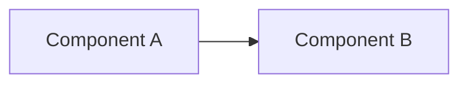

# RFC NNNN: [Название]

<!-- summary -->
> <!-- summary: Краткая суть предложения в 1-2 предложениях -->

---

<!-- summary: Краткая суть предложения в 1-2 предложениях -->
<!-- tags: rfc, спецификация -->

## Status of this Document

`[draft | proposed | accepted | rejected | implemented | superseded]`

## Abstract

[1-2 параграфа: что предлагается и зачем.]

## 1. Introduction

### 1.1 Motivation

[Какую проблему решает RFC. Почему сейчас.]

### 1.2 Scope

[Что в зоне действия документа, что вне.]

### 1.3 Terminology

| Термин | Определение |
|--------|-------------|
| [Термин 1] | [определение] |

## 2. Specification

### 2.1 [Подсекция]

[Конкретные определения, схемы, форматы.]

### 2.2 [Подсекция]

[...]

## 3. Architecture

## 4. Compatibility

### 4.1 Backward compatibility

[Что ломается / не ломается.]

### 4.2 Migration path

[Как мигрировать.]

## 5. Security Considerations

[Угрозы и митигации.]

## 6. Privacy Considerations

[Что делается с PII.]

## 7. Reference Implementation

[Ссылки на код / прототипы.]

## 8. Open Questions

- ?
- ?

## 9. References

- [RFC ABCD](ссылка) — [описание]
- [Связанная работа](ссылка)

## Appendix A. Change Log

| Версия | Дата | Что изменилось |
|--------|------|---------------|
| 0.1 | 2026-04-29 | Initial draft |

---
_Создано: 2026-04-29_

<!-- see-also -->

---

**Смотрите также:**
- [decision-record](docs/templates/decision-record.md)
- [protocol-spec](docs/templates/protocol-spec.md)
