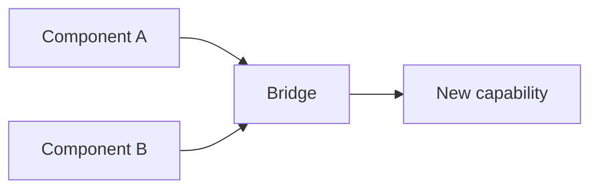

# Tech Pair: [A] × [B]

<!-- summary -->
> Не «хорошо работают вместе».]
Что B делает лучше из-за A
[Тоже конкретно.]
Что появляется только в комбинации
[Эмерджентное свойство — почему пара важнее суммы.]
Архитектура
 
Контракт интеграции
 
Антисинергии
[Что может пойти плохо при объединении.


<!-- toc-auto -->
## Содержание

- [Основной раздел](#основной-раздел)


> [!NOTE]
> Шаблон документа. Заполните поля согласно инструкции.

<!-- alert-added -->


<!-- summary: Какая синергия от объединения A и B -->
<!-- tags: pair, синергия, habr -->

## ID

**PAIR-NNNN**

## Компонент A

| Параметр | Значение |
|----------|---------|
| Название | [A] |
| Автор / репо | [@author / repo] |
| Слой | [memory / knowledge / …] |
| Категория | [hardware / software / deep] |
| Зрелость | [exp / alpha / beta / stable] |

[Краткое описание A в 2-3 предложениях.]

## Компонент B

| Параметр | Значение |
|----------|---------|
| Название | [B] |
| Автор / репо | [@author / repo] |
| Слой | … |

[Краткое описание B.]

## Синергия

### Что A делает лучше из-за B

[Конкретно. Не «хорошо работают вместе».]

### Что B делает лучше из-за A

[Тоже конкретно.]

### Что появляется только в комбинации

[Эмерджентное свойство — почему пара важнее суммы.]

## Архитектура


```mermaid
graph LR
    A[Component A] --> AB[Bridge]
    B[Component B] --> AB
    AB --> Out[New capability]
```

## Контракт интеграции

```yaml
A_to_B:
  format: ...
  protocol: ...
B_to_A:
  format: ...
  protocol: ...
```

## Антисинергии

[Что может пойти плохо при объединении. Конфликты лицензий, языков, runtime.]

## Известные результаты

- [Бенчмарк / эксперимент] — [результат]

## Когда стоит использовать

- [Сценарий 1]
- [Сценарий 2]

## Когда НЕ стоит

- [Антисценарий 1]

## Связанные пары

- [`PAIR-NNNN`](pair-NNNN.md) — [как связана]

## Связанные ансамбли

- [`docs/03-technology-combinations/...`](...)

---
_Создано: 2026-04-29_

<!-- see-also -->

---

## Смотрите также
- [ensemble](ensemble.md)
- [mega-stack](mega-stack.md)

Документ индексирован в базе знаний репозитория. Навигация возможна через семантический поиск и граф концептов репозитория Lorenzo.

<!-- backlinks -->

---

**Кто ссылается на этот документ (7):**
- [READABILITY](../READABILITY.md)
- [READING_TIME](../READING_TIME.md)
- [REGISTRY](../REGISTRY.md)
- [SEARCH](../SEARCH.md)
- [TABLES](../TABLES.md)
- [README](README.md)
- [project-component](project-component.md)


<!-- similar-docs -->

---

**Похожие документы:**
- [tech-pair](../obsidian/templates/tech-pair.md) (сходство 0.91)
- [tech-radar-entry](tech-radar-entry.md) (сходство 0.27)
- [mega-stack](mega-stack.md) (сходство 0.27)

